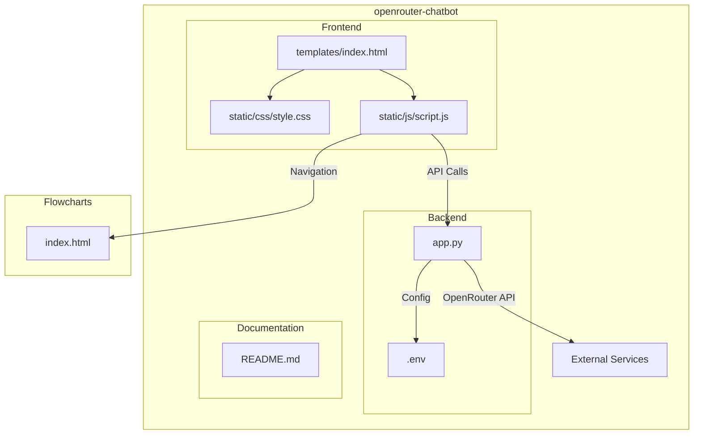

# openrouter-chatbot

## Project Structure

The diagram above shows the main components and their relationships:
- Frontend: Contains the web interface (HTML, CSS, JavaScript)
- Backend: Python Flask application with environment configuration
- External integrations with OpenRouter API
- Separate Flowcharts section for additional functionality

